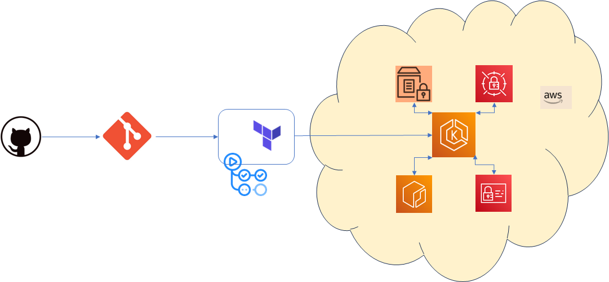
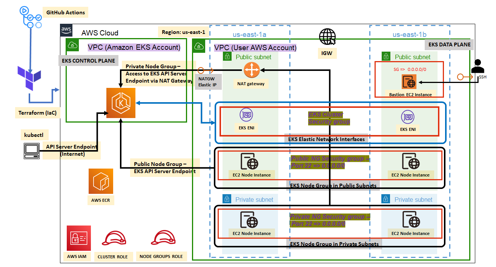
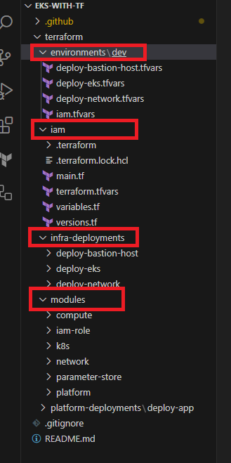
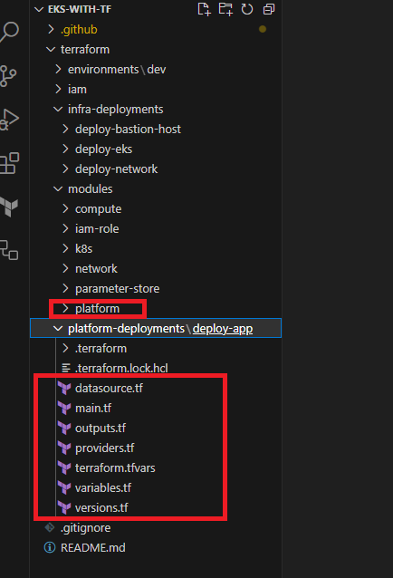
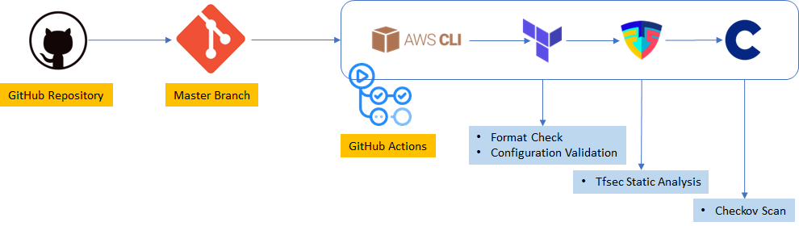

# EKS Deployment with Terraform and GitHub Actions

Welcome to the **EKS Deployment with Terraform and GitHub Actions** repository! 

Region = "eu-central-1"

## Project Overview

This project demonstrates the seamless deployment of applications on Amazon EKS using Terraform and GitHub Actions. The main goal is to provide a comprehensive guide and example for deploying and managing Kubernetes-based applications in an efficient and secure manner.

The project's key features include:

- Leveraging AWS services such as Parameter Store and Secrets Manager for secure configuration management.
- Utilizing GitHub Actions for automated Continuous Integration and Continuous Deployment (CI/CD) pipelines.
- Implementing Infrastructure as Code (IaC) principles with Terraform to provision and manage EKS clusters, networking, and application resources.

## Repository Structure

The repository is organized as follows:

- `/terraform/infra-deployments`: Contains Terraform configurations for provisioning EKS clusters, networking, and other resources.
- `/terraform/platform-deployments`: Contains the application stack code that will be deployed to the EKS cluster.
- `.github/workflows`: Contains GitHub Actions workflow files for CI/CD pipelines.

## Getting Started

To get started with this project:

1. Clone this repository: 
2. Navigate to the `/terraform` directory and customize the Terraform configurations as needed.
3. Review and modify the application stack code in the `/terraform/platform-deployments` directory to match your application requirements.
4. Set up appropriate AWS credentials and permissions for Terraform and GitHub Actions.

## Introduction

This porject delves into a real-world project  that showcases the utilization of various AWS services and tools to achieve seamless deployment of an Elastic Kubernetes Service (EKS) cluster and application deployment on Amazon's Elastic Kubernetes Service (EKS) using Terraform and automated using GitHub Actions. We will explore a comprehensive implementation that leverages AWS Parameter Store, AWS Secrets Manager, AWS EKS, and AWS Network Services, coupled with the power of GitHub Actions for CI/CD.

## Technologies Used

# AWS Systems Manager/ Parameter Store: 
The AWS Parameter Store is a managed service that allows you to store configuration data securely. In this project, the AWS Parameter Store is employed to store inputs for the EKS cluster configuration. This ensures that sensitive information is kept separate from the codebase and can be dynamically retrieved during deployment.

# AWS Secrets Manager:
Securing sensitive information like SSH keys is paramount. AWS Secrets Manager offers a secure and scalable solution for storing, distributing, and rotating secrets. The project utilizes this service to securely manage SSH secret key files required for accessing the Bastion Host.

# AWS EKS:
Amazon EKS simplifies the process of deploying, managing, and scaling containerized applications using Kubernetes. The project sets up an EKS cluster with public and private node groups, each running a desired number of EC2 instances. This architecture provides a balance of security and accessibility.

# AWS Network Services:
The custom VPC and its components, including subnets and security groups, play a pivotal role in creating a secure and isolated networking environment for the EKS cluster and other resources. Properly configuring these components is essential for maintaining a robust infrastructure.

## Building Infrastructure Stack

We are going to build an AWS EKS cluster within a custom multi-tier network. Deployed cloud components will contain an EKS control plane, an EKS data plane with public and private node-groups, IAM roles for the cluster as well as node-groups, and a bastion host EC2 instance in the public subnet to connect the worker EC2 node instances. 

A custom VPC cloud with it’s all the required components will also get deployed in the due process. We will deploy a VPC with two different Subnets. One subnet will be public and one will be private. NAT Gateway will get deployed in one of the public subnets and it’s routes will be registered in the route table to give incoming traffic to worker nodes deployed in the private node group.

All these cloud components will be deployed by using a terraform codebase with workflow defined in GitHub Actions. After a successful deployment of the infrastructure stack, we can access various EKS components using AWS console and kubectl cli utility.

## Code Structure

The above figure shows the codebase highlighted by red boxes is for infrastructure deployment. **infra-deployment** code section has three different main execution sections. **deploy-bastion-host** is for deploying EC2 instances in the public subnet, this EC2 instance can connect to EKS worker nodes via port 22(SSH protocol). **deploy-network** builds the custom VPC network. **deploy-eks** deploys the AWS EKS cluster on a custom VPC network. Bastion host code uses a **compute** module. Network and EKS cluster build uses **network** and **k8s** modules for deploying cloud components. Just above the **infra-deployments** codebase section, there is **iam** codebase, which uses **iam-role** module to deploy cluster and node group-specific IAM roles. **environments** folder contains all terraform input variable values for the dev environment.

## Application Stack

We are going to deploy a simple application stack by using Kubernetes Terraform provider. The application stack will use a Nginx image from docker and deploy application pod and Kubernetes Load Balancer Service, the service type will be AWS Classic Load Balancer.

The above figure shows the simple view of the application deployed in the EKS Cluster using Terraform Kubernetes Provider.

# Code Structure

The above figure shows the codebase highlighted by red boxes is for application/platform. **platform-deployment** code section has one main execution section called deploy-app. deploy-app uses platform module to deploy a simple Nginx webserver application using Kubernetes Terraform Provider. 

## GitHub Action Workflows

GitHub Actions offer a powerful way to automate workflows directly within the GitHub repository. In this project, three distinct pipelines have been set up.

# EKS-With-Terraform CI
This workflow/pipeline can be triggered upon code changes (currently it’s a manual run). It runs tests, linters, and checks to ensure code quality. It acts as an initial gatekeeper before any further deployment actions. There are five jobs defined in this workflow. These jobs are;

iam_ci

network_ci

eks_ci

bastion_host_ci

app_ci

The above figure shows the GitHub Actions CI workflow, which executes some scans for format checking, configuration validation, static code scans for compliance, and vulnerability detection

# EKS-With-Terraform Infrastructure Deployment
Once the code passes the CI workflow/pipeline, this workflow is triggered manually or automatically. It leverages Terraform to deploy the EKS cluster, bastion host, and application stack. AWS Parameter Store and AWS Secrets Manager are used to fetch the necessary configuration securely.

There are five different jobs defined in this workflow;

**Deploy Network**: This job deploys a custom VPC with it’s all required cloud components

**Deploy IAM**: This job deploys two IAM roles. One role is related to Cluster Operations and the other role is for Node Groups.

**Deploy EKS**: This job is related to the above two jobs, once network, and IAM roles are deployed then this job starts it’s execution. It deploys an EKS cluster using the already deployed Network.

**Deploy App**: This job deploys the Nginx web server application in the already deployed EKS cluster. The application is deployed in the default namespace. Classic Load Balancer service is also provisioned for accessing the application.

All the initial inputs for Infrastructure deployment were fetched from the AWS System Manager/ Parameter Store.

# EKS-With-Terraform Deployment Delete
This workflow/pipeline allows for the graceful dismantling of the infrastructure when needed. It cleans up all the resources created during the stack deployment process.

## EKS Elastic Network Interface Significance
# What are ENIs? 
Elastic Network Interfaces (ENIs) are logical networking devices that can be attached to Amazon EC2 instances or AWS Fargate tasks. ENIs provide a way for instances and tasks to communicate with each other and with the outside world.

# How do ENIs work with Amazon EKS? 
When we created the above Amazon EKS cluster, Amazon EKS created a set of ENIs in our account. These ENIs are attached to the EKS control plane, which is a group of Amazon EC2 instances that manage our cluster. The ENIs allow the control plane to communicate with our pods, which are the containers that run our applications (here our demoapp and other system-level pods).

# What are the benefits of using ENIs with Amazon EKS? 
There are several benefits to using ENIs with Amazon EKS:

Performance: ENIs provide a dedicated network interface for each instance or task, which can improve performance.

Security: ENIs can be associated with security groups, which can help to control access to our pods.

Scalability: ENIs can be scaled up or down as needed, which makes them a good choice for clusters that are expected to change in size.

## Contributing

Contributions to this project are welcome! If you find any issues or have improvements to suggest, feel free to submit a pull request.

## License

This project is licensed under the [MIT License](LICENSE).